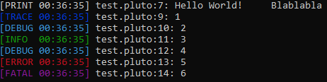

# PlutoLog
A small oop logging lib made in under 40 lines in [Pluto](https://pluto-lang.org/)



<hr>

## Installation
Copy & paste the [plutolog.pluto](src/plutolog.pluto) file in your directory and require it.

```lua
local plutolog <const> = require("src/plutolog")
```

## Features
PlutoLog supports the following log levels:

- trace
- debug
- info
- warn
- error
- fatal

The arguments are separated by tabs.

## Usage
PlutoLog should be always initialized if you want to be able to use the above features.

```lua
local plutolog <const> = require("src/plutolog")

local Log = new plutolog.PlutoLog(true)
Log:init()

Log:trace("This is a trace message!")
```

There are two configurable options for PlutoLog()

### Colors
Toggle colors using **true** or **false**. In the above example, we enabled colors.

### File
The second parameter is the file where you want to log the messages, if you dont provide one then it wont write to one.

## Customizing
You can create, modify, remove log levels because the logic is in the **Modes** table which is exported.

```lua
local plutolog <const> = require("src/plutolog")
plutolog.Modes["print"] = "\27[0m"

local Log = new plutolog.PlutoLog(true)
Log:init()

Log:print("This is a custom log message.")
```
